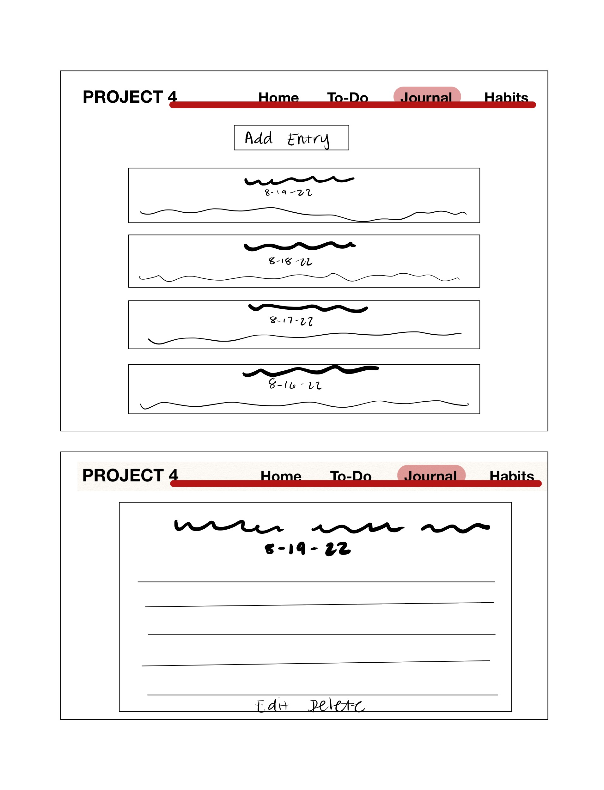

# Project 4 Client

## Description
An app that serves as a destination for all of a user's planning and wellness needs. Users can journal, make to-do lists, and track their habits in their accounts. 

## User Stories

* As a user, I want to be able to create an account
* As a user, I want to be able to sign in
* As a user, I want to be able to log out

* As a user, I want to be able to write journal entries
* As a user, I want to be able to edit journal entries
* As a user, I want to be able to see journal entries
* As a user, I want to be able to delete journal entries

* As a user, I want to be able to make a to-do list
* As a user, I want to be able to edit a to-do list
* As a user, I want to be able to see a to-do list
* As a user, I want to be able to delete a to-do list

* As a user, I want to be able to use a habit tracker API

* As a user, I want to be able to add events to a calendar
* As a user, I want to be able to edit events in a calendar
* As a user, I want to be able to see events in a calendar
* As a user, I want to be able to delete events from a calendar

## Wireframes

## ERDs

## API Link
https://github.com/eshalali/project_4_api